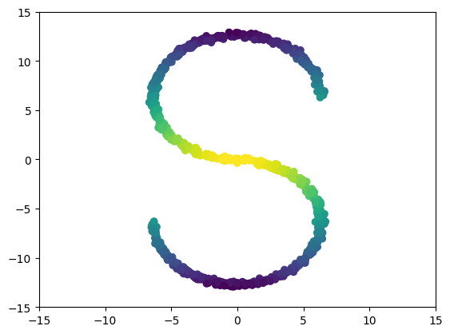

# **Diffusion Schrödinger Bridge**

---

# 大纲

- Motivation
- Methodology
- Results
- Main onclusions

---

# Motivation

背景：

- 计算量
- 找到粒子在两个不同时间的分布下最可能的路径。

---
layout: section

---

# Methodology

> 🔰 Trivial 

- 🔰Schrödinger Bridges           （模型）
- 🔰Score-Based Diffusions        （模型）
- 🔰Iterative Proportional Fitting（算法）
- ✅Diffusion Schrödinger Bridge	（算法）

---

# Methodology - Schrödinger Bridges
Schrödinger bridge 和 Static Schrödinger bridge

## 普通的Schrödinger Bridges 

$$
\pi^{\star}=\arg \min \left\{\mathrm{KL}(\pi \mid p): \pi \in \mathscr{P}_{N+1}, \pi_0=p_{\text {data }}, \pi_N=p_{\text {prior }}\right\}
$$

---

# 🔰Methodology - Schrödinger Bridges

## Static Schrödinger Bridge

$$
\pi^{\mathrm{s}, \star}=\arg \min \left\{\mathrm{KL}\left(\pi^{\mathrm{s}} \mid p_{0, N}\right): \pi^{\mathrm{s}} \in \mathscr{P}_2, \pi_0^{\mathrm{s}}=p_{\text {data }}, \pi_N^{\mathrm{s}}=p_{\text {prior }}\right\}
$$

$\pi$与$\pi^{\mathrm{s}}$的主要差别在于：

- $\pi$ 是 $N+1$ 维 （关注了从$0 \cdots N$时刻）
- $\pi^s$ 是 $2$ 维 （只关注 $0$, $N$时刻）

---

# 🔰Methodology - Schrödinger Bridges

## Link with optimal transport

$$
% \begin{equation}

\begin{aligned}
\text{Original:}&\\
\pi^{\mathrm{s}, \star}&=\arg \min \left\{\mathrm{KL}\left(\pi^{\mathrm{s}} \mid p_{0, N}\right): \pi^{\mathrm{s}} \in \mathscr{P}_2, \pi_0^{\mathrm{s}}=p_{\text {data }}, \pi_N^{\mathrm{s}}=p_{\text {prior }}\right\}  \\
\pi^{\mathrm{s}, \star}&=\arg \min \left\{\mathrm{H}(\pi^s,p_{0, N})-\mathrm{H}(\pi^s): \pi^{\mathrm{s}} \in \mathscr{P}_2, \pi_0^{\mathrm{s}}=p_{\text {data }}, \pi_N^{\mathrm{s}}=p_{\text {prior }}\right\} \\
\pi^{\mathrm{s}, \star}&=\arg \min \left\{-\mathbb{E}_{\pi^s}[p_{0, N}]-\mathrm{H}(\pi^s): \pi^{\mathrm{s}} \in \mathscr{P}_2, \pi_0^{\mathrm{s}}=p_{\text {data }}, \pi_N^{\mathrm{s}}=p_{\text {prior }}\right\} \\
(\text{How?})\pi^{\mathrm{s}, \star}&=\arg \min \left\{-\mathbb{E}_{\pi^{\mathrm{s}}}\left[\log p_{N \mid 0}\left(X_N \mid X_0\right)\right]-\mathrm{H}\left(\pi^{\mathrm{s}}\right): \pi^{\mathrm{s}} \in \mathscr{P}_2, \pi_0^{\mathrm{s}}=p_{\text {data }}, \pi_N^{\mathrm{s}}=p_{\text {prior }}\right\}
\end{aligned} 
% \end{equation}
$$

---

# Methodology - Iterative Proportional Fitting (IPF)
这里的记号比较奇怪，和之前不太一样。上标代表的是当前的迭代次数，也就是说迭代n次代表n个“来回”：
$$
\begin{aligned}
\pi^{2 n+1} & =\arg \min \left\{\mathrm{KL}\left(\pi \mid \pi^{2 n}\right): \pi \in \mathscr{P}_{N+1}, \pi_N=p_{\text {prior }}\right\} \\
\pi^{2 n+2} & =\arg \min \left\{\mathrm{KL}\left(\pi \mid \pi^{2 n+1}\right): \pi \in \mathscr{P}_{N+1}, \pi_0=p_{\text {data }}\right\} 
\end{aligned}
$$
已知：
$$
p^0\left(x_{0: N}\right)=p\left(x_{0: N}\right)
$$
向后更新：
$$
q^n\left(x_{0: N}\right)=p_{\text {prior }}\left(x_N\right) \prod_{k=0}^{N-1} p_{k \mid k+1}^n\left(x_k \mid x_{k+1}\right), \text{with }  p_{k \mid k+1}^n\left(x_k \mid x_{k+1}\right)=\frac{p_{k+1 \mid k}^n\left(x_{k+1} \mid x_k\right) p_k^n\left(x_k\right)}{p_{k+1}^n\left(x_{k+1}\right)}
$$
向前更新：
$$
p^{n+1}\left(x_{0: N}\right)=p_{\mathrm{data}}\left(x_0\right) \prod_{k=0}^{N-1} q_{k+1 \mid k}^n\left(x_{k+1} \mid x_k\right), \text{with }q_{k+1 \mid k}^n\left(x_{k+1} \mid x_k\right)=\frac{q_{k \mid k+1}^n\left(x_k \mid x_{k+1}\right) q_{k+1}^n\left(x_{k+1}\right)}{q_k^n\left(x_k\right)}
$$

---

# (Before)Methodology - Diffusion Schrödinger Bridge

有：
$$
\begin{equation}
\begin{aligned}
  p_{k \mid k+1}\left(x_k \mid x_{k+1}\right)&=\frac{p_k\left(x_k\right) p_{k+1 \mid k}\left(x_{k+1} \mid x_k\right)}{p_{k+1}\left(x_{k+1}\right)} \\
  &=p_{k+1 \mid k}\left(x_{k+1} \mid x_k\right) \frac{p_k\left(x_k\right)}{p_{k+1}\left(x_{k+1}\right)}\\
  &=p_{k+1 \mid k}\left(x_{k+1} \mid x_k\right) \exp \left[\log p_k\left(x_k\right)-\log p_{k+1}\left(x_{k+1}\right)\right]

\end{aligned}  
\end{equation}
$$

和

$$
\begin{equation}
\begin{aligned}
  p_{k+1 \mid k}\left(x_{k+1} \mid x_k\right)&=\mathcal{N}\left(x_{k+1} ; x_k+\gamma_{k+1} f\left(x_k\right), 2 \gamma_{k+1} \mathbf{I}\right) \\
  &=\frac{1}{\sqrt{4 \pi \gamma_{k+1}}} \exp \left(-\frac{\left(x_{k+1}-x_k-\gamma_{k+1} f\left(x_k\right)\right)^2}{4 \gamma_{k+1}}\right)
  
\end{aligned}
\end{equation}
$$

---

# (Before)Methodology - Diffusion Schrödinger Bridge

使用泰勒展开：我们对 $\log p_{k+1}$ 在 $x_k \approx x_{k+1}$ 处进行泰勒展开。泰勒展开是:
$$
\log p_{k+1}\left(x_{k+1}\right) \approx \log p_{k+1}\left(x_k\right)+\frac{x_{k+1}-x_k}{1 !} \nabla \log p_{k+1}\left(x_k\right)
$$

代入泰勒展开: 将泰勒展开代入原始公式后并化简：
$$
\begin{aligned}

p_{k \mid k+1}\left(x_k \mid x_{k+1}\right) & \approx p_{k+1 \mid k}\left(x_{k+1} \mid x_k\right) \exp \left[\log p_k\left(x_k\right)-\log p_{k+1}\left(x_k\right)-\left(x_{k+1}-x_k\right) \nabla \log p_{k+1}\left(x_k\right)\right] \\

&= p_{k+1 \mid k}\left(x_{k+1} \mid x_k\right) \exp \left[-2\left(x_{k+1}-x_k\right) \nabla \log p_{k+1}\left(x_k\right)\right] \\

&\ \ \vdots \quad \text{算不动了} \\

&= \mathcal{N}\left(x_k ; x_{k+1}-\gamma_{k+1} f\left(x_{k+1}\right)+2 \gamma_{k+1} \nabla 
\log p_{k+1}\left(x_{k+1}\right), 2 \gamma_{k+1} \mathbf{I}\right)

\end{aligned}
$$

---

# Methodology - Diffusion Schrödinger Bridge

对于第n次迭代，首先向前：

$$
\begin{aligned}
p_{k+1 \mid k}^n\left(x_{k+1} \mid x_k\right)&=\mathcal{N}\left(x_{k+1} ; x_k+\gamma_{k+1} f_k^n\left(x_k\right), 2 \gamma_{k+1} \mathbf{I}\right) \\
\text{with, } & p^0=p \text { and } f_k^0=f
  
\end{aligned}
$$

然后，向后：

$$
\begin{aligned}
q_{k \mid k+1}^n\left(x_k \mid x_{k+1}\right) & =p_{k+1 \mid k}^n\left(x_{k+1} \mid x_k\right) \exp \left[\log p_k^n\left(x_k\right)-\log p_{k+1}^n\left(x_{k+1}\right)\right] \\
& \approx \mathcal{N}\left(x_k ; x_{k+1}+\gamma_{k+1} b_{k+1}^n\left(x_{k+1}\right), 2 \gamma_{k+1} \mathbf{I}\right),\\
\text{where}\ & b_{k+1}^n\left(x_{k+1}\right)=-f_k^n\left(x_{k+1}\right)+2 \nabla \log p_{k+1}^n\left(x_{k+1}\right)
\end{aligned}
$$

> 然后对于这个DSB算法的得分应该先比DDPM低，然后再超过DDPM。因为一开始直接近似为高斯分布，误差会非常大，需要多次迭代。

---

# Methodology - Diffusion Schrödinger Bridge

现在我们要优化的目标就是：
$$
q_{k \mid k+1}^n\left(x_k \mid x_{k+1}\right)=\mathcal{N}\left(x_k ; B_{k+1}^n\left(x_{k+1}\right), 2 \gamma_{k+1} \mathbf{I}\right), p_{k+1 \mid k}^n\left(x_{k+1} \mid x_k\right)=\mathcal{N}\left(x_{k+1} ; F_k^n\left(x_k\right), 2 \gamma_{k+1} \mathbf{I}\right)
$$

因此：
$$
\begin{aligned}
& B_{k+1}^n=\arg \min _{B \in \mathrm{L}^2\left(\mathbb{R}^d, \mathbb{R}^d\right)} \mathbb{E}_{p_{k, k+1}^n}\left[\left\|B \left(X_{k+1}\right)-\left(X_{k+1}+F_k^n\left(X_k\right)-F_k^n\left(X_{k+1}\right)\right)\right\|^2\right] \\
& F_k^{n+1}=\arg \min _{F \in \mathrm{L}^2\left(\mathbb{R}^d, \mathbb{R}^d\right)} \mathbb{E}_{q_{k, k+1}^n}\left[\left\|F \left(X_k\right)-\left(X_k+B_{k+1}^n\left(X_{k+1}\right)-B_{k+1}^n\left(X_k\right)\right)\right\|^2\right]
\end{aligned}
$$

> 这里我认为有一个推论就是，DSB在每次迭代的时候，都是在优化一个最小二乘问题。

---
layout: image-right

# the image source
image: ./img/alg.png
---
# Methodology - Diffusion Schrödinger Bridge

每个iteration需要计算两次

---

# Train

## Loss function

$$
\begin{aligned}
 \hat{\ell}_{n, I}^b(\beta)&=M^{-1} \sum_{(k, y) \in I}\left\|B_\beta\left(k+1, X_{k+1}^{\jmath}\right)-\left(X_{k+1}^{\jmath}+F_k^n\left(X_{k+1}^j\right)-F_k^n\left(X_k^{\jmath}\right)\right)\right\|^2 \\
 \hat{\ell}_{n+1, I}^{\jmath}(\alpha)&=M^{-1} \sum_{(k, y) \in I}\left\|F_\alpha\left(k, X_k^{\jmath}\right)-\left(X_k^j+B_{k+1}^n\left(X_{k+1}^j\right)-B_{k+1}^n\left(X_k^{\jmath}\right)\right)\right\|^2 
\end{aligned}
$$

---
layout: two-cols
---

# Results

   
  

::right::

# 不同DSB迭代次数的结果

   
  

---

# Disscussion

- 加速 Score-based generative modeling
- 原理是通过近似模拟IPF算法